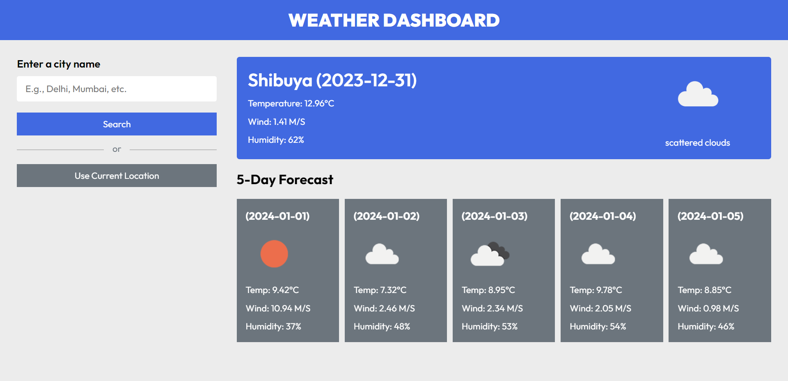

# Weather App

Welcome to the Weather App repository! This project is a JavaScript-based web application designed to display the weather forecast for the current location and the previous 5 days. Built with HTML, CSS, and JavaScript, it uses the OpenWeather API for weather information and features a modern UI design for an intuitive and user-friendly experience.

## Preview



## Features

- **Current Location Weather:** Get real-time weather information for your current location.
- **5-Day Forecast:** View the weather forecast for the previous 5 days.
- **OpenWeather API Integration:** Fetch accurate and up-to-date weather data dynamically.
- **Modern UI Design:** Sleek layout and visually appealing design for an enjoyable user interface.

## Getting Started

To run the Weather App locally, follow these steps:

1. Clone the repository to your local machine:

   ```bash
   git clone https://github.com/Devsethi3/Weather-App.git
   ```

2. Open the `index.html` file in your preferred web browser.

## Usage

1. Allow the app to use your current location or manually enter a location.
2. Click the "Get Weather" button to fetch and display the current weather and 5-day forecast.

## API Used

This project utilizes the [OpenWeather API](https://openweathermap.org/api) to fetch weather information.

## Customization

Feel free to customize this project to fit your preferences. Update styles, colors, and layout in the HTML and CSS files. You can also extend the functionality to include additional features or customization options.

## Contributing

If you'd like to contribute to this project, please follow these steps:

1. Fork the repository.
2. Create a new branch for your feature or improvement.
3. Make your changes and commit them with descriptive messages.
4. Push your changes to your forked repository.
5. Open a pull request to merge your changes into the main branch.

Explore the Weather App, stay informed about the weather, and consider contributing to its development. Thank you for checking out the repository!